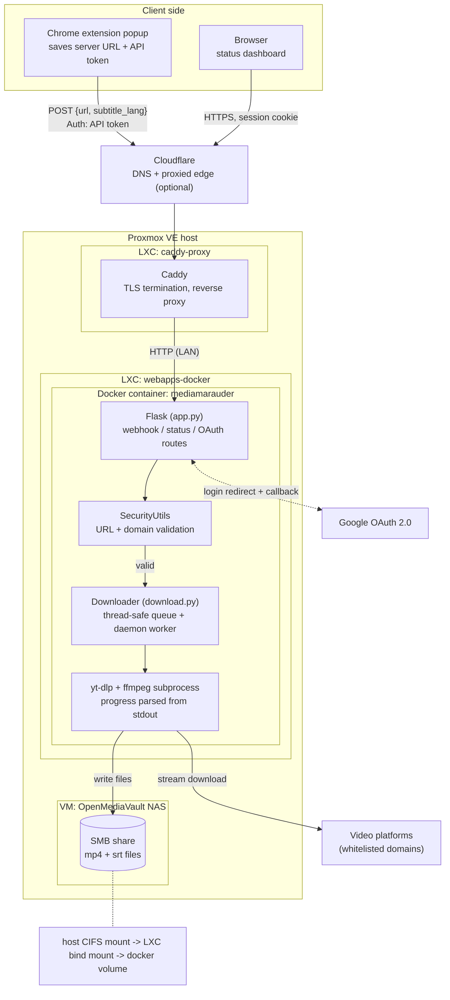
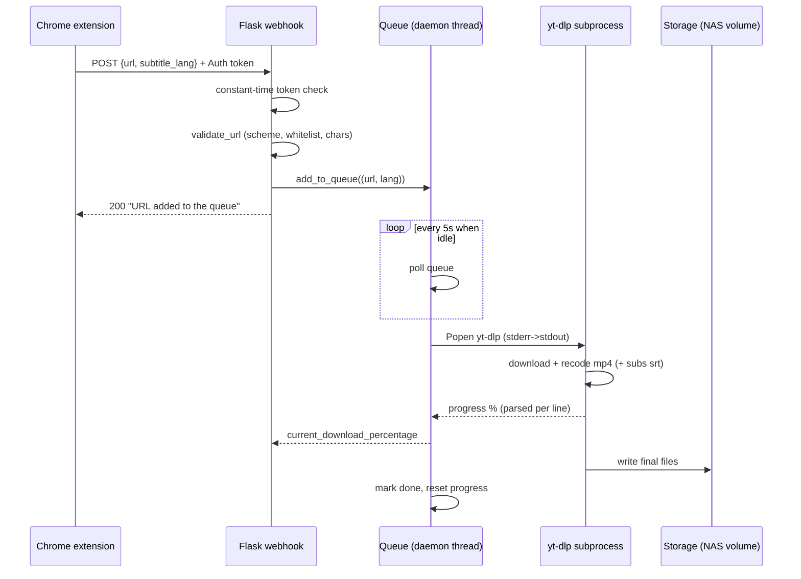
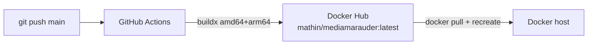

# MediaMarauder -- Architecture Documentation

## 1. Overview

MediaMarauder is a Dockerized video downloader service. It accepts video URLs submitted via a Chrome extension or direct HTTP POST to a webhook, queues them, and processes downloads using `yt-dlp`. The backend is a Flask application with Google OAuth-protected status monitoring, real-time progress tracking, and optional subtitle downloads.

**Primary use case:** Personal media archiving from supported video platforms (YouTube, SVT Play, etc.) with organized local storage.

**Deployment:** Docker container behind a reverse proxy (Caddy + Let's Encrypt) handling TLS termination.

---

## 2. System Architecture



### Download sequence



### CI/CD



---

## 3. Module Breakdown

### 3.1 `app.py` -- Flask Application Entry Point

**Role:** HTTP routing, authentication integration, and queue processor lifecycle.

**Routes:**

| Route | Method | Auth | Description |
|---|---|---|---|
| `/` | GET | None | Loader page (Vite React app, auto-redirects to `/landing` after 3s) |
| `/landing` | GET | None | Landing page with "move on" animation and login link |
| `/login` | GET | None | Initiates Google OAuth consent flow (defined in `auth.py`) |
| `/auth` | GET | None | OAuth callback: validates email, stores user in session (defined in `auth.py`) |
| `/logout` | GET | None | Clears session, redirects to `/` (defined in `auth.py`) |
| `/{WEBHOOK_PATH}` | POST | API token (`Auth` header) | Validates URL against whitelist, adds `(url, subtitle_lang)` to download queue |
| `/{STATUS_PATH}` | GET/POST | Google OAuth (`@login_required`) | Returns JSON: queue, downloaded files, current status, download percentage |
| `/status-page` | GET | Google OAuth (`@login_required`) | Renders HTML status dashboard with real-time polling |

**Startup sequence:**
1. Create `Downloader` singleton
2. Call `init_auth(app)` -- registers OAuth routes, returns `@login_required` decorator
3. Call `start_queue_processor()` -- launches `process_queue()` as a daemon thread
4. Call `app.run(host="0.0.0.0", port=5000)`

### 3.2 `download.py` -- Download Queue Manager

**`Downloader` class -- single instance, shared across the Flask app.**

**State (protected by `threading.Lock`):**

| Field | Type | Description |
|---|---|---|
| `url_queue` | `list` | FIFO queue of `(url, subtitle_lang)` tuples |
| `downloaded_files` | `list` | History of completed/failed downloads with status |
| `processing` | `bool` | Whether the queue processor thread is alive |
| `stop_processing_flag` | `bool` | Graceful shutdown signal |
| `current_download_status` | `str` | Human-readable status string (e.g., "Downloading https://...") |
| `current_download_percentage` | `float` | 0-100 progress from yt-dlp's `[download] N%` output |

**Key methods:**

| Method | Description |
|---|---|
| `add_to_queue(item)` | Thread-safe append to `url_queue` |
| `process_queue()` | Infinite loop: pops URLs, calls `download_file()`, sleeps 5s when idle. Respects `stop_processing_flag`. |
| `download_file(url, subtitle_lang)` | Spawns `yt-dlp` subprocess, parses progress from stdout, records result in `downloaded_files` |
| `sanitize_filename(url)` | Extracts last path segment from URL, decodes, strips dangerous characters |
| `get_queue()` / `get_downloaded_files()` / `get_current_download_status()` / `get_current_download_percentage()` / `is_processing()` | Thread-safe getters |

**yt-dlp command construction:**

```bash
yt-dlp \
   --progress \
   -o "{DOWNLOAD_PATH}%(title)s.%(ext)s" \
   --recode-video mp4 \
   --yes-playlist {url} \
   [--write-subs --sub-lang {lang}.* --convert-subs srt]    # if subtitle_lang is provided
```

**Critical detail:** `stderr=subprocess.STDOUT` prevents subprocess blocking on large downloads (>1GB) by ensuring all output flows through a single consumed stream rather than filling an unused stderr pipe buffer.

### 3.3 `auth.py` -- Google OAuth Integration

**`init_auth(app)` function:**
- Sets `app.secret_key` to the persistent `SECRET_KEY` from `config.py`
- Registers Google as an OAuth 2.0 provider via Authlib
- Defines `/login`, `/auth`, and `/logout` routes on the Flask app
- Returns the `login_required` decorator

**OAuth flow:**
1. User visits `/login` → redirected to Google consent page with `redirect_uri=/auth`
2. Google callbacks to `/auth` → retrieves access token, fetches user info
3. User's email is validated against `ALLOWED_EMAIL` config value
4. On success: `session['user'] = userinfo`, redirect to `/status-page`
5. On failure: redirect back to `/login` (OAuth denied) or return 400/401

**`@login_required` decorator:**
- Checks `session['user']` existence
- Returns `{"error": "Unauthorized"}` (401) if not logged in

### 3.4 `securityUtils.py` -- URL Validation & Path Safety

**`SecurityUtils` class (static methods only):**

| Method | Description |
|---|---|
| `validate_url(url)` | Checks: scheme starts with `http`, host exists, domain is in `WHITELISTED_DOMAINS`, no `;`, `|`, or `&&` in URL |
| `sanitize_filename(filename)` | Removes `<>:"/\|?*` characters |
| `ensure_safe_path(base, filename)` | Constructs absolute path, ensures no directory traversal (path must start with `base`) |

**Usage:** `validate_url()` is called in the webhook route before queuing URLs. `sanitize_filename()` and `ensure_safe_path()` are available but currently only `sanitize_filename` is indirectly used via `Downloader.sanitize_filename()` (which reimplements the same logic).

### 3.5 Configuration (`config.py`, derived from `config_example.py`)

| Variable | Type | Description |
|---|---|---|
| `DOWNLOAD_PATH` | `str` | Local directory for downloaded files (e.g., `"downloads"`) |
| `WEBHOOK_PATH` | `str` | URL path for the download webhook (e.g., `"/download"`) |
| `STATUS_PATH` | `str` | URL path for the status API (e.g., `"/status"`) |
| `WHITELISTED_DOMAINS` | `list[str]` | Allowed domains for download URLs (suffix match) |
| `API_TOKENS` | `dict` | `{user: token}` mapping for webhook authentication |
| `SECRET_KEY` | `str` | Flask session secret key (persistent across restarts) |
| `GOOGLE_CLIENT_ID` | `str` | Google OAuth client ID |
| `GOOGLE_CLIENT_SECRET` | `str` | Google OAuth client secret |
| `ALLOWED_EMAIL` | `str` | Single email allowed to access the status page |

---

## 4. Frontend

### 4.1 Loader Page (`templates/index.html`)

A Vite-bundled React 19.2.3 app served at `/`. Features:
- Spinning logo animation (dark theme)
- Automatic redirect to `/landing` after 3 seconds via embedded `<script>`
- Static assets in `static/assets/` (hashed filenames for cache busting)

### 4.2 Landing Page (`templates/index2.html`)

Served at `/landing`. Shows:
- "Nothing here to see..." message
- Animated `move_on.webp`
- GitHub project link
- `/login` link for status page access

### 4.3 Status Dashboard (`templates/status.html`)

Served at `/status-page` (behind `@login_required`). Features:
- Logout button (redirects to `/logout`)
- Progress bar section (visible during active downloads)
- **Real-time polling:** `fetch()` to `STATUS_PATH` every 1 second
- XSS protection: all dynamic content escaped via `escapeHtml()`
- Displays: current status, queue contents, downloaded files list

---

## 5. Chrome Extension (`ChromeExtension/`)

**Manifest V3** extension that submits the active tab's URL to the webhook.

### Structure

| File | Description |
|---|---|
| `manifest.json` | Manifest V3, permissions: `activeTab`, `storage`, `scripting`, `tabs`. Host permission: all `http/https` origins. |
| `popup.html` | 300px popup UI: server URL input, token input, three subtitle language buttons (`sv`, `en`, `de`), status div |
| `popup.js` | Loads saved `serverUrl` and `token` from `chrome.storage.local`. On language button click: gets active tab URL, POSTs `{url, subtitle_lang}` to webhook with `Auth: token` header. Auto-closes popup 3s after success. |
| `content.js` | Empty (no content script logic) |
| `icon.png` | Extension icon |

### User flow:
1. User installs extension, opens popup
2. Enters server URL and API token, clicks save (persisted to `chrome.storage.local`)
3. Navigates to a video page, opens extension popup
4. Clicks a subtitle language button (`sv`/`en`/`de`)
5. Extension POSTs the tab URL + language to the webhook
6. Server validates, queues the download, responds with status

---

## 6. Data Flow

### 6.1 Download Request Flow

```
Chrome Extension / HTTP Client
          │ POST {url, subtitle_lang}
          │ Header: Auth: {token}
          ▼
   ┌──────────────┐
   │  Webhook       │
   │  Route         │
   └──────┬───────┘
          │
          ├─► Validate API token against API_TOKENS
          ├─► SecurityUtils.validate_url(url)   (scheme, host, domain whitelist)
          └─► downloader.add_to_queue((url, subtitle_lang))
                       │
                       ▼
             ┌────────────────┐
             │ Downloader       │
             │ process_queue() │   (daemon thread, polls every 5s)
             └────────┬───────┘
                      │ pop (url, subtitle_lang)
                      ▼
             ┌────────────────┐
             │ download_file() │
             │ spawns yt-dlp    │
             │ parses progress   │
             └────────┬───────┘
                      │
                      ▼
            DOWNLOAD_PATH/ (host-mounted volume)
```

### 6.2 Status Check Flow

```
Browser (polls every 1s)
          │ GET/POST {STATUS_PATH}
          │ Session: user data
          ▼
   ┌──────────────┐
   │  Status        │
   │  Route         │
   │  @login_required│
   └──────┬───────┘
          │
          ▼
  JSON Response:
   {
    queue: [...],
    downloaded_files: [...],
    current_status: "Downloading ...",
    current_download_percentage: 45.2
   }
```

---

## 7. Threading Model

```
Main Thread                Daemon Thread
     │                           │
     │  Flask request handling  │
     │  (routes, auth)          │
     │                          │  process_queue() loop
     │                          │     ├─ wait (5s sleep)
     │                          │     ├─ pop from url_queue
     │                          │     └─ download_file() (blocking subprocess)
     │                          │
     │   ← thread-safe getters →│
     │   (get_queue, get_       │
     │   downloaded_files,       │
     │   get_current_*)          │
```

**Thread safety:** A single `threading.Lock` protects all shared state in `Downloader`. All writes to `url_queue`, `downloaded_files`, `current_download_status`, and `current_download_percentage` are wrapped in `with self.lock`.

**Limitation:** `download_file()` is a blocking call holding the daemon thread. Concurrent downloads are not supported -- each URL is processed sequentially.

---

## 8. Deployment

### Docker

```dockerfile
FROM python:3.11-slim
# Installs: Python deps, ffmpeg, yt-dlp binary
WORKDIR /app
EXPOSE 5000
CMD ["python", "app.py"]
```

### Docker Compose

```yaml
services:
  mediamarauder:
    ports: ["443:5000"]
    volumes:
       - ./:/app                     # Source code + config
       - /letsencrypt/certs:/certs   # TLS certificates
    environment:
      SSL_CERT_FILE: /certs/cert.pem
      SSL_KEY_FILE: /certs/key.pem
    restart: unless-stopped
```

**Note:** SSL/TLS is handled by an external reverse proxy (Caddy). Flask runs without `ssl_context`. The mounted certificates in `docker-compose` are for the reverse proxy's consumption.

### CI/CD

GitHub Actions (`.github/workflows/deploy.yml`):
- Trigger: push to `main`
- Build: multi-arch Docker image (`linux/amd64`, `linux/arm64`) via Buildx + QEMU
- Push: `mathin/mediamarauder:latest` to Docker Hub

---

## 9. Dependencies

| Package | Version | Purpose |
|---|---|---|
| `flask` | 2.2.5 (pinned) | Web framework (pinned for Authlib compatibility) |
| `yt-dlp` | latest | Video download engine |
| `werkzeug` | >=3.1.4 | Security fix (CVE-2025-66221) |
| `urllib3` | >=2.6.0 | Security fix (CVE-2025-66471, CVE-2025-66418) |
| `Authlib` | 1.6.5 | Google OAuth 2.0 integration |
| `python-dotenv` | 0.19.0 | Environment variable loading |

**System dependencies:** `ffmpeg` (video recoding), `yt-dlp` binary (GitHub release).

---

## 10. Security

| Mechanism | Implementation |
|---|---|
| **Webhook auth** | API token in `Auth` header, validated against `API_TOKENS` dict |
| **Status page auth** | Google OAuth 2.0 with email restriction to `ALLOWED_EMAIL` |
| **URL validation** | Scheme check (`http*`), host presence, domain suffix whitelist, rejection of `;`, `|`, `&&` |
| **Filename sanitization** | Strips `<>:"/\|?*` characters |
| **Path traversal protection** | `SecurityUtils.ensure_safe_path()` validates resolved path stays within base directory |
| **XSS protection** | `escapeHtml()` applied to all dynamic content in status dashboard |
| **TLS** | External reverse proxy (Caddy + Let's Encrypt) |
| **Session persistence** | `SECRET_KEY` from `config.py` (survives container restarts) |

---

## 11. Known Issues & Technical Debt

| Issue | Severity | Details |
|---|---|---|
| **No test suite** | Medium | Zero automated tests. Manual testing only. |
| **Single-threaded downloads** | Medium | Only one download at a time. The daemon thread blocks on `download_file()`. |
| **No download retry** | Low | Failed downloads are recorded with error status but not re-queued. |
